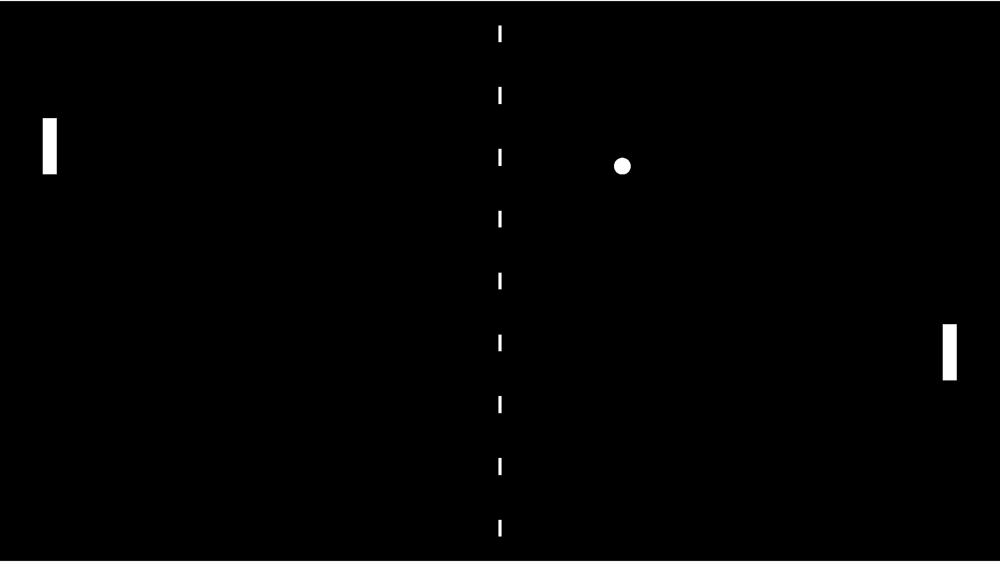
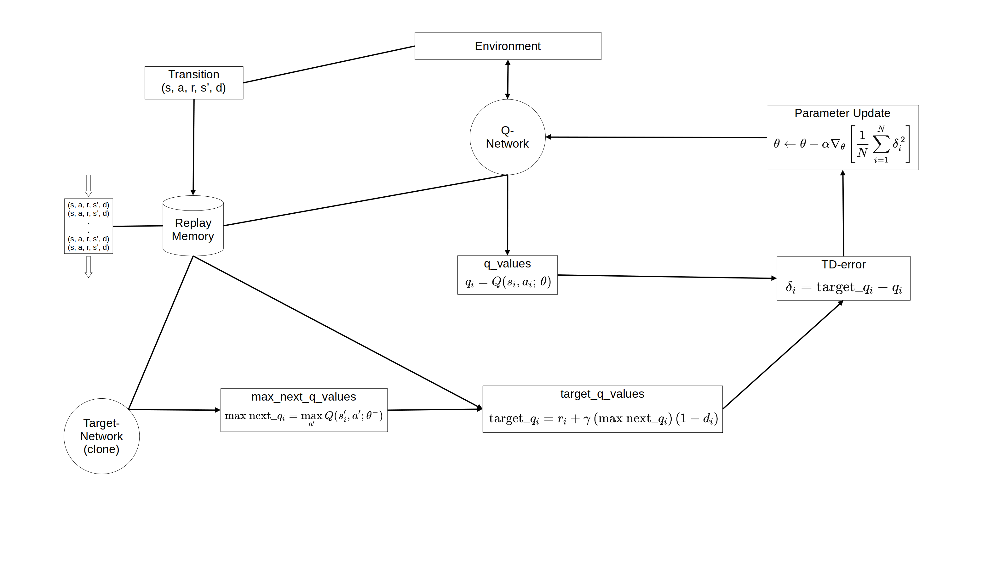
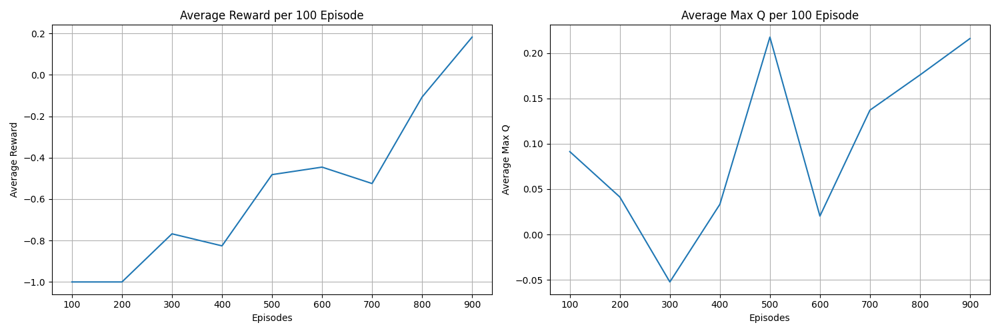

# DQN-in-Unity-2D-Pong-using-a-Python-Low-Level-API
Unity provides a Python low-level API that allows anyone to apply their own reinforcement learning algorithms to objects. This approach enables a deep understanding of reinforcement learning implementation without relying on libraries like Gym or Stable-Baselines3. ML-Agents is used only to observe the environment and retrieve observations into Python.

DQN is used with an MLP, taking the paddle and ball coordinates as neural network inputs. To enhance training, Prioritized replay and Multi-step learning—two techniques from Rainbow DQN—are also applied. This project is implemented in PyTorch, based on the DQN paper [*Playing Atari with Deep Reinforcement Learning*](https://www.cs.toronto.edu/~vmnih/docs/dqn.pdf), [*Human-level control through deep reinforcement
learning*](https://web.stanford.edu/class/psych209/Readings/MnihEtAlHassibis15NatureControlDeepRL.pdf), and the Rainbow DQN paper [*Rainbow: Combining Improvements in Deep Reinforcement Learning*](https://arxiv.org/pdf/1710.02298.pdf).

You can play against the Paddle AI directly in your browser [Play on itch.io](https://apzmie.itch.io/2d-pong-ai), on both PC and mobile devices.

## Environment
### Unity
- Unity Editor: 6000.3.0f1
- ML Agents: 4.0.0
- Inference Engine: 2.2.2

### Python
- Python 3.10.12 (for Training)
- Python 3.12.12 (for ONNX Conversion)

## DQN Diagram

### Epsilon
The agent selects actions using an epsilon-greedy policy. At the beginning of training, epsilon is set to 1.0 to encourage random actions and sufficient exploration. Epsilon is gradually decreased over time using an epsilon decay rate, so that the agent focuses more on exploitation rather than exploration. Epsilon is not reduced to 0 because this would cause the agent to lose opportunities for further improvement.

### Target Q-value
The target of Q-value is calculated as the sum of immediate reward and the maximum Q-value of the next state. This is because the value of a current action depends on the quality of the resulting future state. The discount factor gamma is set to 0.99 instead of 1.0 to prevent the Q-value from growing infinitely. In the original theoretical formula, gamma is raised to the power of t to give more importance to short-term rewards rather than long-term rewards.
However, in the actual code implementation, the power of t is not applied to gamma. This is because the Q-value is updated toward the target Q-value, the target network is periodically updated by copying the current Q-network, and the value produced by the target network already has the discount factor applied, so no further discounting is needed.

### Additional Techniques
#### - DQN
- TD-error clipping: limits the magnitude of TD error
- Initial collection: fills the replay memory with random transitions before training
- State skipping: skips some states while repeating the same action

Value-based inputs are used instead of frame inputs for faster learning.

#### - Rainbow DQN
- Prioritized replay: samples transitions with large TD errors more frequently
- Multi-step learning: updates Q-values using cumulative rewards from several steps

Implementing only these two techniques resulted in faster learning.

## Learning Progress

This was conducted in an environment where the ball speed was fixed and the ball angle varied depending on the contact point with the paddle.

In the average reward graph, rewards gradually increase as epsilon decays, showing that learning is progressing well. In the average max Q-value graph, the first inflection point occurs to adjust the initial random Q-values, and the second inflection point occurs to adjust action choices toward better strategies.

## Results
When the ball angle was fixed, the paddle was able to return almost all incoming balls. However, when the ball angle varied depending on the contact point with the paddle, the paddle occasionally failed to return the ball, even though the model was saved after achieving a test score of over 600 points with epsilon set to 0.0. Additionally, when the ball speed varied, the training process became unstable and failed to converge. It is considered that DQN updates action values solely based on past transitions without modeling the environment dynamics, which may lead to overfitting to a specific trajectory under diverse ball dynamics.
